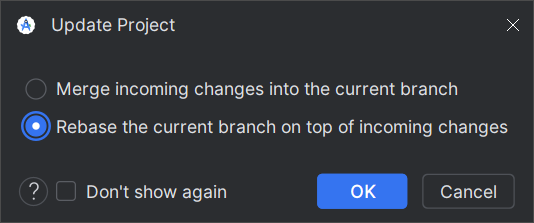

# Git: Ветки и версионирование

Ветки (`branch`) - очень мощный инструмент в Git.
Они позволяют разделять и соединять между собой разные направления разработки:
стабильную версию, новые идеи/наработки, исправления багов. <br>

## 1. Типы веток

* `master` - Стабильная версия (Release). В этой ветке содержатся
  только коммиты, прошедшие экспертизу и проверенные на железе.

* `develop` - Ветка для разработки (Beta). В этой ветке ведется большая часть разработки.
  Должна основываться на `master` (содержать в себе все коммиты оттуда). При внесении изменений в `master`
  они должны быть перенесены в начало `develop` через [git rebase](https://www.atlassian.com/git/tutorials/rewriting-history/git-rebase).
  По завершении работы коммиты из `develop` переносятся в `master` путем открытия *Pull Request* <br>
  **NB**: Не смотря на то, что это `develop`, программный код должен проверяться и соответствовать правилам оформления.

* Экспериментальные ветки (Experimental/Feature). Содержат в себе экспериментальные изменения, пока не достойные основных веток.
  Основывается на `develop`, по завершении работы переносится в `develop` и закрывается. <br>
  До закрытия ветки особых требований к программному коду нет.

## 2. Cлияние веток

Git предполагает два типа слияния веток: **Merge** и **Rebase**

Предположим, у нас есть основная ветка `main` и ветка
`feature`, которая начинается от коммита `B`, в которой мы работаем. 

```
A---B---C---D   (main-ветка)
     \       
      E---F---G (feature-ветка)
```

Пока мы работали над `feature`, ветка `main` ушла вперед. Там содержатся очень
важные изменения, которые мы хотим иметь в своей ветке.

### Merge

```shell
git checkout feature # Перейти в ветку feature
git merge master     # Сделать merge master в рабочую ветку
```

`git merge master` применит изменения, сделанные в ветке `master` с тех пор, как 
она начала отличаться от `feature` (то есть коммиты `C`, `D`), поверх ветки
`feature`. Это приведет к появлению нового коммита `H`, объединяющего две ветки:

```
A---B-----C-----D   (main-ветка)
     \           \  
      E---F---G---H (feature-ветка)
```

Достоинства:

* Мы совершили слияние двух веток, не меняя историю в прошлом. <br>
Это означает, что merge - более **безопасная** операция, которая не испортит жизнь
другим людям, работающим над той веток, потому что **не меняет историю**.

Недостатки:

* Создается лишний коммит, по сути не несущий в себе новой информации
* Если ветки сильно отличаются и при слиянии возникли конфликты, то их
придется разрешать все сразу. <br>
Это означает, что merge может **усложнить историю**, а процесс слияния веток становится
**менее интуитивным**.

### Rebase

```shell
git checkout feature # Перейти в ветку feature
git rebase master    # Сделать rebase рабочей ветки поверх master
```

`git rebase master` выкинет все коммиты в ветке `feature` (`E`, `F`, `G`) с тех пор,
как она ушла от ветки `master` (коммит `B`) и вновь применит их поверх
конца ветки `master` (коммит `D`). В итоге ветка `feature` будет выглядеть, как будто
её начали не от коммита `B`, а от коммита `D`. Мы **подменили основание ветки**.

```
A---B---C---D              (main-ветка)
             \  
              E*---F*---G* (feature-ветка)
```

Обратите внимание, что коммиты (`E`, `F`, `G`) и (`E*`, `F*`, `G*`) - не то же самое!
У них разное основание, а, может, и содержание.

Достоинства:

* История более линейная. Мы забыли, что ветка `feature` когда-то основывалась на `B`.
* Не порождаются новые коммиты
* Если возникают конфликты при слиянии, то они будут разрешаться по очереди, редактируя
каждый коммит (`E`, `F`, `G`) по отдельности. <br>
Это означает, что rebase позволяет иметь более прозрачную и читаемую историю.

Недостатки:
* **Мы меняем историю!** Если кто-то другой работал с веткой `feature`, пока мы сделали
её rebase, то это приведет к проблемам, так как у другого человека в рабочем пространстве
будут коммиты, которых теперь не существует
* **Мы меняем историю!** И редактируем все коммиты в истории. Если быть неаккуратным, 
то можно потерять какой-нибудь коммит
* Могут возникнуть проблемы с тем, что бы запушить ветку после rebase. Чаще всего мы двигаем
историю вперед, а право на изменение истории в прошлом есть только у администраторов.
для этого используется `git push --force`.<br>
Это означает, что **rebase** - опасная операция, которая может испортить историю и создать
проблемы, если над одной веткой работают несколько человек

### Какой тип слияния выбрать?

#### Rebase

1. Когда нужна более чистая и читаемая история
3. Когда необходимо изменить историю задним числом
2. Когда нужно синхронизировать рабочую ветку с изменениями,
произошедшими в основной ветке.

Идеально подходит для веток, над которой работает один человек. В том числе для
слияния удаленной ветки в локальную (например `origin/develop` в `develop`).

#### Merge

1. Когда изменение истории недопустимо
2. Когда нужна более детализированная история
3. Когда необходимо применить изменения из рабочей ветки в основную

Идеально подходит для веток, с которой работают сразу несколько человек.

## 3. Правила работы с ветками

1. Недопустимо использовать **merge** для слияния удаленных веток (`remote`) в локальные. 
В таких случаях необходимо использовать rebase


2. Ветка `master` - главная. Изменения в ней появляются только в результате слияния с другой веткой через *pull request*. 
Коммиты напрямую в `master` недопустимы.

3. Каждый **merge** в ветку `master` - выпуск новой версии.

4. От ветки `develop` допускается создавать `feature`-ветки, под
конкретные задачи.

5. Название `feature`-ветки должно соответствовать задаче, которую она
решает.

6. Над `feature`-веткой одновременно работает только один человек.

7. В конце работы над `feature` она сливается с `develop` через *pull request*.
После этого ветка закрывается.

8. Перед слиянием ветки `B` в ветку `A` ветка `B` должна содержать в себе
все коммиты из `A`. Таким образом, слияние веток можно осуществить посредством т.н.
**fast-forward merge**, когда коммиты из `B` линейно применяются к `А`:
```
---A     main (A)
    \
     B   feature (B)
     
После слияния:

---A---B main (A)
```

## 4. Версионирование

Предлагается следующая схема версионирования: <br>

```
v<Мажорная версия>.<Минорная версия>
```

* Каждый раз, когда вносятся изменения в `master`, номер версии увеличивается.

* К каждому существенному мероприятию (начало сезона, встреча, сорвенования),
  должна быть готова новая  **Мажорная** версия

* Версия может увеличиваться и между мероприятиями. В таком случае выходит **Минорная** версия

* Первая версия - `v0.0`