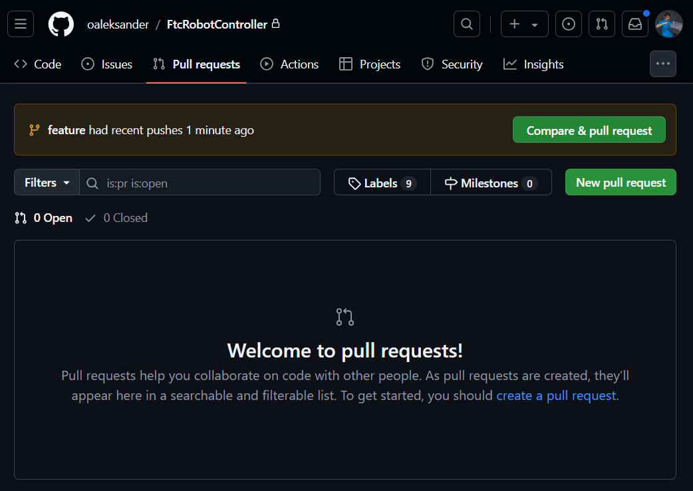
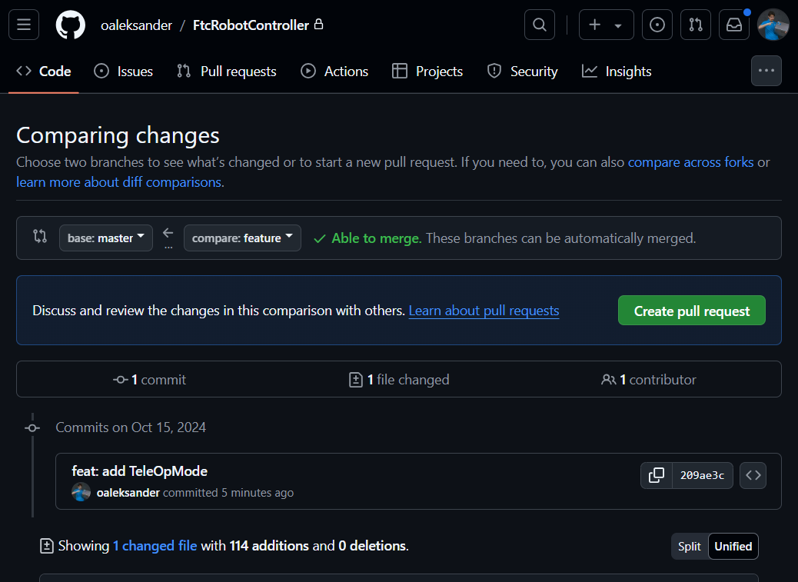
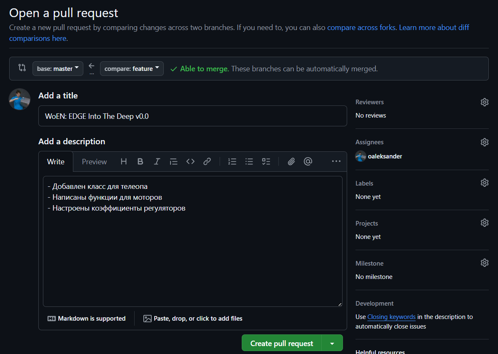
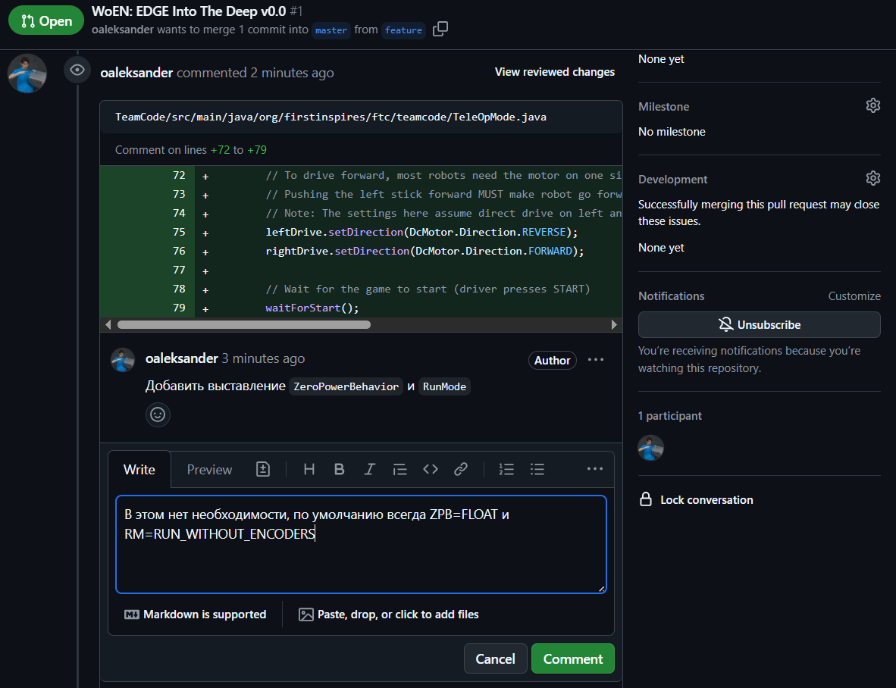
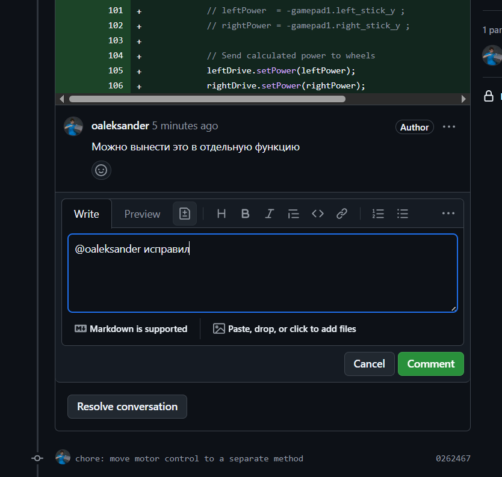
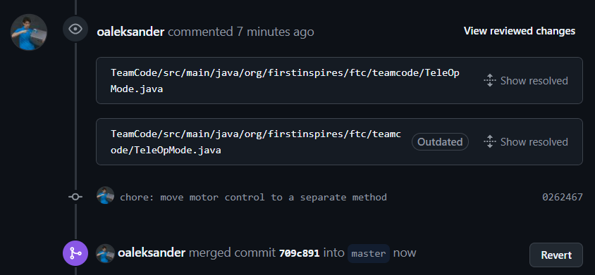

# Git: Pull Request и код-ревью

С каждым релизом новой версии и при интеграции `feature`-веток
предлагается проходить процедуру код-ревью. Для этого можно
воспользоваться инструментом **Pull Request** на GitHub, позволяющим
осуществлять слияние веток только после стороннего аудита (просмотра) кода.

Возможные слияния веток:

* `develop` <- `feature` <br>
Один раз, после этого `feature`-ветка удаляется. Под очередной PR
создается новая ветка.

* `master` <- `develop` <br>
Несколько раз, под каждый релиз.
  
### Краткое описание процесса

1. Программисты создают коммиты в рабочей ветке
2. Когда результат готов, программисты создают **Pull request**
3. Ответственными (**Assignees**) назначаются программисты,
аудиторами (**Reviewers**) - преподаватели
4. (**Reviewers**) дают замечания по написанному коду
5. (**Assignees**) исправляют замечания, создают новые коммиты
6. (**Reviewers**) фиксируют исправления замечаний и закрывают **Pull request**.

## 1. Открытие Pull Request

Переходим в наш репозиторий, открываем вкладку **Pull requests**. <br>
Нажимаем **New pull request**.



Выбираем ветки для слияния:

* **base** - *Куда* сливаем, главная ветка
* **compare** - *Что* сливаем, рабочая ветка (наша)

После выбора будут показаны коммиты, которые впоследствии будут добавлены к
**base** ветке. Также необходимо убедиться, что ветки можно сливать - 
в **feature** должны быть все коммиты из **base**.

Наконец, нажимаем **Create pull request**



Теперь необходимо написать название и описание **pull request**.

Формат названия (**title**):

* Для релиза (`master` <- `develop`):
```
WoEN: <название_команды> <Название_сезона> v<версия>
```
* Для фичи (`develop` <- `feature`):
```
<название_фичи>
```

Описание (**description**) - в свободной форме, с кратким описанием того,
что добавилось/удалилось/изменилось.

---

Также необходимо указать ответственных людей:

* **Assignees** - Люди, ответственные за написанный в ветке код. <br> 
(Среди них должен быть сам автор **Pull request**)
* **Reviewers** - Люди, которые будут осуществлять код-ревью. <br>
(Среди них должны быть преподаватели - как минимум `@oaleksander`)

После этого можно нажимать **Create pull request**.



## 2. Код-ревью

После открытия **Pull request** будет доступна соответствующая страница на
GitHub, где **Reviewers** могут оставлять комментарии по поводу написанного
**Assignees** кода.

* Задача **Reviewers**: внимательно просмотреть все коммиты и дать замечания.

* Задача **Assignees**: исправить замечания, либо объяснить, почему приняты именно такие решения.

**Reviewer** создает ветки дискуссии, выделяя конкретный участок кода. <br>
**Assignee** может дать ответ замечаниям **Reviewer** в этой же ветке.



В случае, если **Assignee** принял замечания, он должен их исправить через
новый коммит в рабочей ветке. 
(Кстати, на такой случай можно использовать тип коммита `chore`).

После добавления коммита он будет отражен в дискуссии **Pull request**.
Но можно также отдельно оповестить **Reviewer** (`@`) в соответствующей дискуссии,
что его замечания исправлены.



## 3. Cлияние веток

Необходимые условия для слияния веток:

1. Все **дискуссии** закрыты (**resolved**).
2. У рабочей ветки **нет конфликтов** с целевой.
3. Последний коммит в целевой ветке проходит **pipeline** (проект собирается).



После выполнения необходимых условий один из **Reviewers** осуществляет
слияние веток. После этого **Pull request** считается закрытым.
